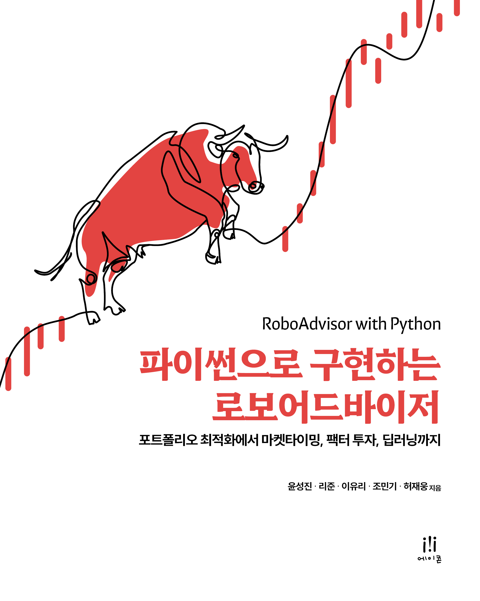

# 파이썬으로 구현하는 로보어드바이저
**본 저장소는 [파이썬으로 구현하는 로보어드바이저] 책에서 설명하는 자산배분 프로그램의 소스 코드를 제공하고 있습니다.**

## 로컬 환경에 설치하기

파이썬 실행과 본 저장소를 가져오기 위한 툴을 설치합니다. 

1. [아나콘다](https://www.anaconda.com/products/distribution) (or [미니콘다](https://docs.conda.io/en/latest/miniconda.html)) 설치 
2. [깃](https://git-scm.com/downloads) 설치
3. GPU에 호환되는 CUDA와 cuDNN 설치

터미널에서 다음 명령을 입력해서 본 저장소를 가져옵니다

    $ git clone https://github.com/RAAILab/PyRA.git
    $ cd pyRA

다음 명령으로 가상 환경을 생성합니다.

    $ conda create -n pyra python==3.9

가상 환경을 활성화하고 패키지를 설치합니다.

    $ conda activate PyRA
    $ pip install -r requirements.txt

CUDA 및 cuDNN 버전에 맞는 PyTorch를 설치합니다.  
예를 들어, 1.13.1 버전의 PyTorch와 11.7 버전의 CUDA를 설치하려면 다음과 같은 명령을 실행합니다.

    $ conda install pytorch==1.13.1 torchvision==0.14.1 torchaudio==0.13.1 pytorch-cuda=11.7 -c pytorch -c nvidia

만일 GPU가 없는 환경이라면 다음과 같은 명령을 실행합니다.

    $ conda install pytorch==1.13.1 torchvision==0.14.1 torchaudio==0.13.1 cpuonly -c pytorch
    
설치 명령어는 https://pytorch.org/get-started/previous-versions/ 를 참조하세요.

마지막으로 커널을 추가하고 주피터 노트북을 실행합니다.

    $ pip install ipykernel
    $ python -m ipykernel install --user --name=pyra
    $ jupyter notebook

##  파일 구성

### 실행파일
|구분   |파일                       |설명                        |
|:--        |:--        |:--                          |
|공통 | 	/data/data_loader.py	| Pykrx를 이용한 주가 데이터 스크랩핑 |
|3장 | 	3. mean_variance.ipynb	| 평균분산모델을 이용한 자산배분 전략 |
|4장 | 	4. moving_average.ipynb	| 이동평균 기반의 마켓타이밍 전략|
|	 | 4. momentum.ipynb	| 모멘텀 기반의 마켓타이밍 전략|
|5장 | 	5. market monitoring.ipynb	| 시장 모니터링|
|	 | /monitoring/technical_indicator.py	| RSI, ADR, MACD 기술지표 계산|
|6장 | 	6. factor strategies.ipynb	| 단일 팩터 투자|
|7장 | 	7. multi factor strategy.ipynb	| 멀티 팩터 투자|
|	 | /factor/factor_strategy.py	| 멀티 팩터 투자를 위한 팩터 전략 포트폴리오 및 수익률 csv 생성|
|8장 | 	8. deep learning (gru).ipynb	| RNN 모델 기반의 KOSPI 예측 및 수시 리밸런싱 시뮬레이션 (ETF, MVO)|
|	 | /dl_models/gru.py	| RNN 모델|
|	 | 8. deep learning (nlinear).ipynb	| NLinear 모델 기반의 KOSPI 예측 및 수시 리밸런싱 시뮬레이션 (ETF, MVO)|
|	 | /dl_models/nlinear.py	|NLinear 모델|
|	 | 8. deep learning (scinet).ipynb	| SciNet 모델 기반의 KOSPI 예측 및 수시 리밸런싱 시뮬레이션 (ETF, MVO) |
|	 | /dl_models/scinet.py	|SciNet 모델 |
|9장 | 9. black_litterman.ipynb	| 블랙 리터만 모델을 이용한 자산배분 전략 |
|	 | 9. risk_parity.ipynb	| 리스크 패러티 모델을 이용한 자산배분 전략 |

###  시뮬레이션 관련 파일
|파일                       |설명                        |
|:--        |:--                          |
| /simulation/order.py	| 주문 클래스 정의
| /simulation/transaction.py | 거래 클래스 정의
| /simulation/broker.py	| 중개인 클래스 정의
| /simulation/asset_position.py	| 자산 포지션 클래스 정의
| /simulation/account.py	| 계좌 클래스 정의
| /simulation/config.py	| 수수료, 슬리피지, 거래량 관련 파라미터 설정
| /simulation/utility.py	| 유틸리티 함수 정의 |
| /simulation/metric.py	| 투자 성능 지표 정의 |
| /simulation/visualize.py	| 시각화 관련 함수 |
| /simulation/diagram.puml	| 클래스 다이어그램 UML 파일 |

## 라이선스

이 저장소의 소스 코드는 [MIT 라이선스](http://www.opensource.org/licenses/MIT)를 따릅니다.
비상용뿐 아니라 상용으로도 자유롭게 이용하실 수 있습니다.

## 자주 묻는 질문

**어떤 파이썬 버전을 사용해야 하나요?**

Python 3.9를 권장합니다. 위의 설치 가이드를 따르면 3.9 버전이 설치됩니다. Python 3.10 이상의 버전을 사용할 때에는 호환되는 라이브러리 버전을 설정해야 합니다.

**어떤 pytorch 버전을 사용해야 하나요?**

Pytorch 1.13.1을 권장합니다. 위의 설치 가이드를 따르면 이 버전이 설치됩니다. Pytorch 1.7.1 이상의 버전이면 모두 작동합니다.

**ValueError: Mime type rendering requires nbformat>=4.2.0 but it is not installed 에러가 발생합니다.**

이는 MIME 타입 렌더링과 관련된 문제로 Jupyter 노트북에서 노트북 포맷을 다루는 데 사용하는 nbformat 라이브러리가 특정 버전이 설치되어 있지 않을 때 발생합니다. 아래와 같이 언급된 버전 이상으로 설치한 후 커널을 재실행하면 정상 작동합니다.

    $ pip install nbformat>=4.2.0

